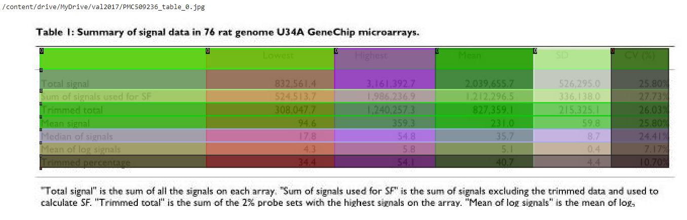
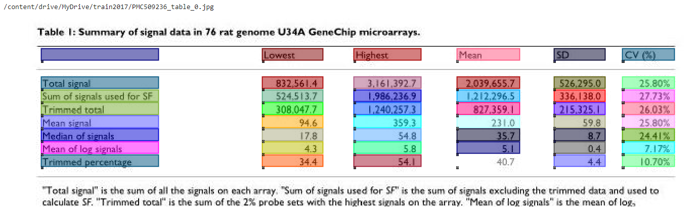

***
# 1M_to_coco

**This repository contains scripts to convert [PubTables-1M dataset](https://msropendata.com/datasets/505fcbe3-1383-42b1-913a-f651b8b712d3) to [COCO format](https://cocodataset.org/#format-data) for Functional Analysis and Table Structure Recognition. (See examples below)**

## Project status

- FA conversion (xml_to_coco.py) is stable.
- Current version of TSR conversion (json_to_coco.py) works for around 85% of tables.

- Update to come :
    - extend TSR conversion to all tables

## Data preparation

Download and extract following tar.gz files from [PubTables-1M](https://msropendata.com/datasets/505fcbe3-1383-42b1-913a-f651b8b712d3) :

- PubTables-1M-Image_Page_Detection_PASCAL_VOC.tar.gz
- PubTables-1M-Image_Table_Structure_PASCAL_VOC.tar.gz
- PubTables-1M-PDF_Annotations_JSON.tar.gz

1. For FA the root directory must contain xml files from Image_Page_Detection_PASCAL_VOC

2. For TSR the following structure is expected:
```
path/to/root/
    json/               #json files from PDF_Annotations_JSON
    xml_detection/      #xml files from Image_Page_Detection_PASCAL_VOC
    xml_structure/       #xml files from Image_Table_Structure_PASCAL_VOC
```

## Installation

**1. Cloning**

With https :
```
git clone https://github.com/RaphaelJehl/1M_to_COCO.git

```
**2. Python**

Python version used is 3.9.0

Check with :
```
python --version
```

**3. Dependencies**

Create a virtual environment
```
cd path/to/1M_to_COCO/installation/folder
python -m venv venv
```
Activate your virtual environment
```
venv\Scripts\activate
```
Install dependencies
```
pip install -r requirements.txt
```

## Usage

1. Functional Analysis
```
python xml_to_coco.py --root /path/to/root/directory --out fa_annotations.json
```

2. Table Structure Recognition
```
python json_to_coco.py --root /path/to/root/directory --out tsr_annotations.json
```

### 1. Functional Analysis 
### 2. Table Structure Recognition 

## Useful links :
- PubTables-1m [Github repository](https://github.com/microsoft/table-transformer)
- PubTables-1m [Research paper](https://arxiv.org/pdf/2110.00061.pdf)
- PubTables-1m [Dataset](https://msropendata.com/datasets/505fcbe3-1383-42b1-913a-f651b8b712d3)

[COCO homepage](https://cocodataset.org/#home)

[Detectron2 colab notebook to visualize annotations](https://colab.research.google.com/drive/16jcaJoc6bCFAQ96jDe2HwtXj7BMD_-m5#scrollTo=FsePPpwZSmqt)

***
